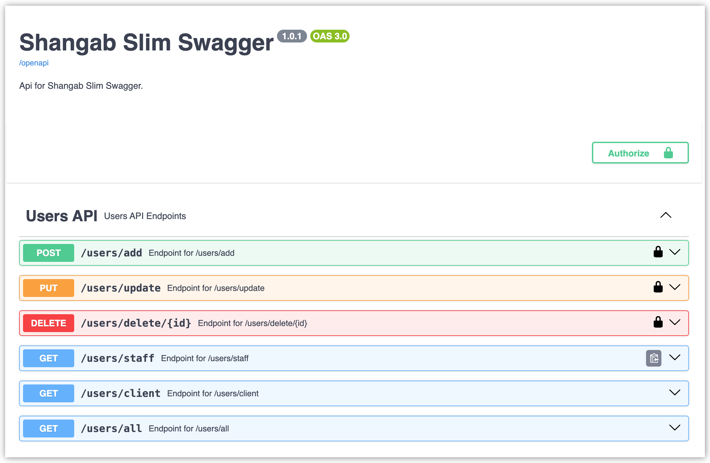

# Slim Swagger Middleware

This is a Slim PHP middleware that automatically generates and serves Swagger (OpenAPI) documentation for your Slim PHP API routes. It supports dynamic route scanning, including GET, POST, PUT, PATCH, and DELETE methods, and generates detailed documentation without requiring external annotation libraries. This project was created for a project I am working on in `php`. I used to do backend with `Python FatAPI` or `.NET`, which both have swagger UI embeded in them, out of the box. However in `php` swagger it is tricky and time consuming.

I wanted the same automatic swagger in `php` in my new project but the easiest way I found is using external packages such as `zircote/swagger-php` which requires a lot of annotations if I got it right. I loved the fact that `slim-php` is light, powerful and scalable, Therefore, I started to build this middleware. The first version, `tag`, was built in a hurry in a single day, but the future roadmap will increase the middleware power and flexibility.

All the best wishes, use, recommend, star, fork, contribute, spread and enjoy it.

## Features

- **Automatic Swagger generation**: Scans all Slim routes and generates OpenAPI documentation on the fly.
- **Supports multiple HTTP methods**: Handles GET, POST, PUT, PATCH, DELETE, and more.
- **No external annotations**: Does not rely on any library or any third-party annotation libraries like `zircote/swagger-php`.
- **Customizable**: Easily extendable to add custom parameters, request bodies, and responses.
- **MIT License**: Open-source and free to use under the MIT License.

## Requirements

1. php 8.2
2. "slim/slim": "^4.9"
3. "slim/psr7": "^1.5"

<!-- image  -->



## The classes to be used

We now have three classes:

1. `ShangabSlimSwagger` The middleware for the swagger openapi and ui.
2. `ShangabJWTAuth` The middleware for authenticated routes or group of routes.
3. `ShangabJWTUtil` A utility class that have four public functions, to handle authorization using `shangab/slim-swagger` you should use this utility class:
   1. `public function createToken($userData): string` Given a user json object it will generates JWT token.
   2. `public function verifyToken(): mixed` This will verify the header `Authorization` bearer token and returns the user data or false if not authenticated.
   3. `public function getTempPassword($length = 5): string` This fuction will return a temporary password, default length is 5.
   4. `public function getHash256($text): string` This function takes any text and gives a 256 hash code.

## Step 1: Installation

You can install this middleware in your Slim project via Composer from `https://packagist.org/`.

```bash
composer require shangab/slim-swagger
```

### Step 2: How to use `ShangabJWTUtil`

Use this class to:

1. Create `JWT` tokens for logged-in users.
2. Verify that the user has valid tokens.
3. Generate temporary passwords.
4. Hash text as you see fit.

To use the `ShangabJWTUtil` class in your code, see below example:

```php
use Shangab\Middleware\ShangabJWTUtil;

$jwtUtil = new ShangabJWTUtil;
```

2.1 To crate a `JWT` token:

```php
$user =[LOGIN THE USER WITH YOUR CONTROLLER CODE];
$jwtToken = $jwtUtil->createToken($user);
```

2.2 To verify a `JWT` token, though the middleware does it for you, but f you want to:

```php
$verified = $jwtUtil->verifyToken(); // token will be read from the request headers.
```

2.3 To generate a temporary password:

```php
$password = $jwtUtil->getTempPassword(8);
```

2.4 To hash any text:

```php
$hashed = $jwtUtil->getHash256("Hello World!");
```

### Step 3: How to use The Middleware

To use the middleware follow the code below, declare the `ShangabSlimSwagger` middleware and add it to your app in `index.php`:
First list all the protected groups of endpoints or endpoints, then list the un-protected ones.

```php
use Shangab\Middleware\ShangabSlimSwagger;
use Shangab\Middleware\ShangabJWTAuth;
```

```php
$app = AppFactory::create();

$app->add(new ShangabSlimSwagger($app, 'Shangab Slim Swagger', '1.0.1', 'Api for Shangab Slim Swagger.'));

// Protected endpoins same group: "users"
$app->group('/users', function ($app) use ($container) {
    $app->post('/add', function (Request $request, Response $response, $args) use ($container) {
        $body = $request->getBody()->getContents();
        $user = json_decode($body, true);
        $container['data']['users'][] = $user;
        $users = $container['data']['users'];
        $response->getBody()->write(json_encode(['status' => true, 'message' => 'User addded', 'users' => $users]));
        return $response->withHeader('Content-Type', 'application/json');
    });
    $app->put('/update', function (Request $request, Response $response, $args) use ($container) {
        $body = $request->getBody()->getContents();
        $user = json_decode($body, true);
        $key = array_search($user['id'], array_column($container['data']['users'], 'id'));
        $container['data']['users'][$key] = $user;
        $users = $container['data']['users'];
        $response->getBody()->write(json_encode(['status' => true, 'message' => 'User updated', 'users' => $users]));
        return $response->withHeader('Content-Type', 'application/json');
    });
    $app->delete('/delete/{id}', function (Request $request, Response $response, $args) use ($container) {
        $id = $args['id'];
        $users = array_values(array_filter($container['data']['users'], function ($user) use ($id) {
            return $user['id'] != $id;
        }));
        $response->getBody()->write(json_encode(['status' => true, 'message' => 'User deleted', 'users' => $users]));
        return $response->withHeader('Content-Type', 'application/json');
    });
})->add(new ShangabJWTAuth($app));

// All routes above this middleware will apply ShangabJWTAuth middleware protected routes.
// Below routes will not be protected by ShangabJWTAuth middleware.

// UnProtected endpoins same group: "users"
$app->group('/users', function ($app) use ($container) {
    $app->get('/staff', function (Request $request, Response $response, $args) use ($container) {
        $users = array_values(array_filter($container['data']['users'], function ($user) {
            return $user['type'] == 'staff';
        }));
        $response->getBody()->write(json_encode($users));
        return $response->withHeader('Content-Type', 'application/json');
    });
    $app->get('/client', function (Request $request, Response $response, $args) use ($container) {
        $users = array_values(array_filter($container['data']['users'], function ($user) {
            return $user['type'] == 'client';
        }));
        $response->getBody()->write(json_encode($users));
        return $response->withHeader('Content-Type', 'application/json');
    });
    $app->get('/all', function (Request $request, Response $response, $args) use ($container) {
        $users = $container['data']['users'];
        $response->getBody()->write(json_encode($users));
        return $response->withHeader('Content-Type', 'application/json');
    });
});


$app->run();

```

### Please avoid using route names `openapi` and `docs`

I use these two routes and serve them before the `$app` routes, `openapi` returns the OpenAPI Specs,
while `docs` route returns the swagger UI shown above.
